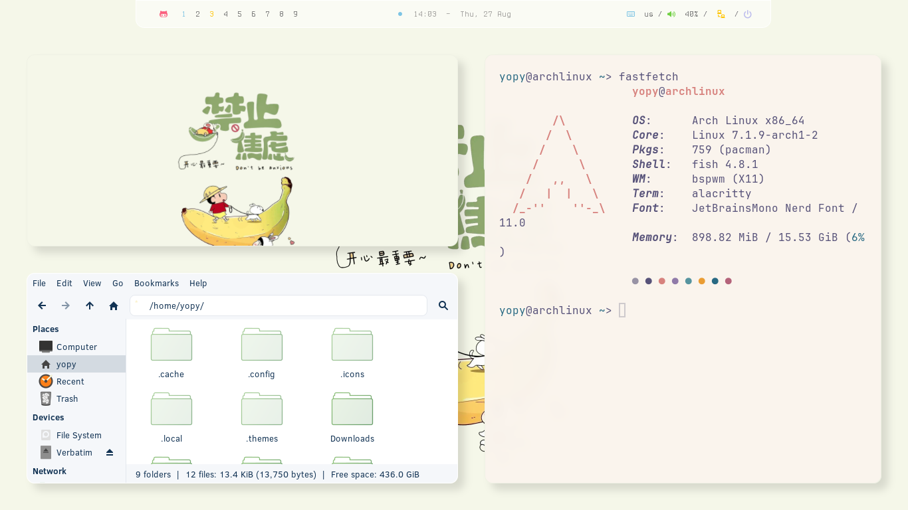
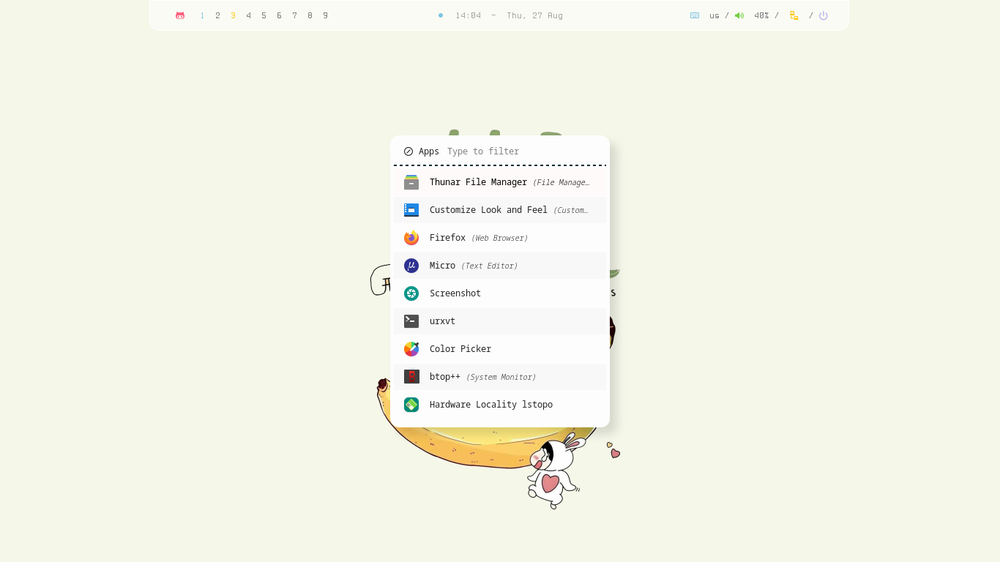
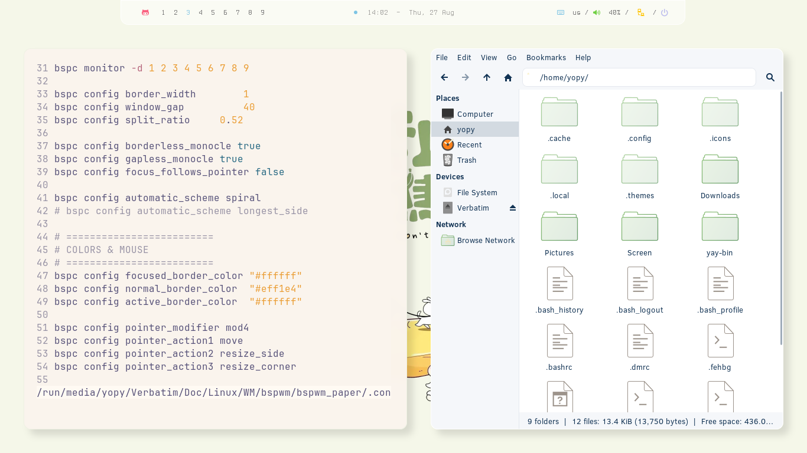
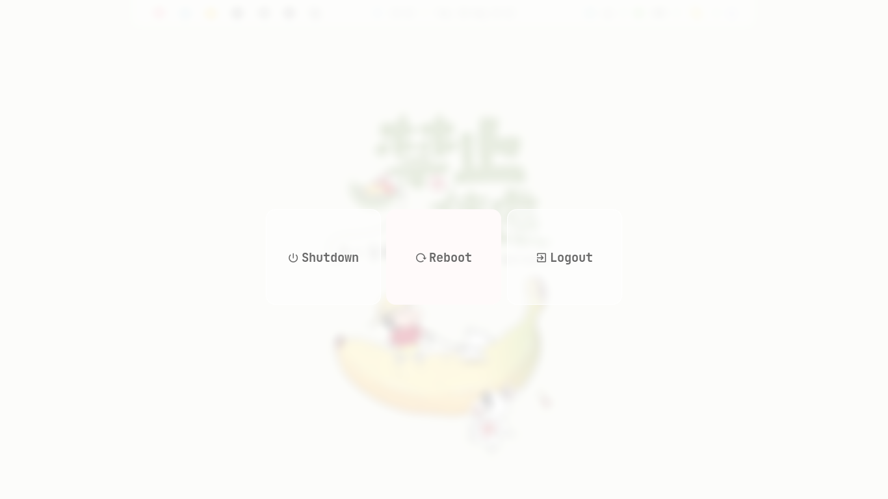

| **Window Manager**  | `bspwm`  |
| :----------------------------------- | :------------------------- |
| **Hotkeys daemon**                   | `sxhkd`                    |
| **Status bar**                       | `polybar`                  |
| **Terminal**                         | `alacritty`                |
| **Launcher**                         | `rofi`                     |
| **Wallpaper**                        | `feh`                      |
| **Compositor**                       | `picom`                    |
| **Screenshot**                       | `maim`                     |
| **Viewer**                           | `imv`                      |

#### Fonts / Theme

**Symbols Nerd Font** - icons, interface, development.  
**JetBrains Mono** - system font and interface.

**Clear Sans 10** - System Font  
**Zorin Light** - Theme  
**Gruvbox** - Icons

### 🧼 Installation

#### 1. Boot to the Arch iso

```
archinstall

on the step - profile - select > desktop > bspwm
```

#### 2. After installing - Reboot and update system

```
sudo pacman -Syu

sudo pacman -S \
    xorg-server \
    xorg-xinit \
    xorg-xrandr \
    xorg-xset \
    xorg-xsetroot
```

#### 3. Installing BSPWM

```
sudo pacman -S \
bspwm \
sxhkd \
   alacritty \
   polybar \
   rofi \
   picom \
   feh \
   maim \
   slop \
   xclip \
   dunst \
   i3lock
```

> [!IMPORTANT]
> Give execution rights to configuration scripts

```
chmod +x ~/.config/bspwm/bspwmrc
chmod +x ~/.config/polybar/launch.sh
```

#### 4. Installing Pkgs

```
sudo pacman -S \

alacritty \
   foot \
   micro \
   mousepad \
   firefox

thunar \
   thunar-archive-plugin \
   thunar-volman

fastfetch \
   mc \
   xarchiver \
   tumbler \
   btop

p7zip \
   unzip \
   zip \
   tar \
   atool

wget \
   git \
   curl \
   gvfs \
   udisks2 \
   ntfs-3g

xdg-utils \
   ripgrep \
   zoxide \
   xfce4-screenshooter

imv \
   celluloid \
   rhythmbox \
   imagemagick \
   ffmpeg \
   lxappearance
```

#### 5. Installing FISH

```
sudo pacman -S \
fish \
   eza \
   fzf \
   fd

chsh -s $(command -v fish)
```

#### Home Structure

```text
~/
├── Pictures/
├── Screen/
├── icons/
├── themes/
├── .local/share/fonts/
└── .config/
    ├── bspwm/
    ├── sxhkd/
    ├── polybar/
    ├── rofi/
    └── picom/
```

#### Used Dots, Icons, Themes, Wallpapers

> [!NOTE]
> [yojeero/config_linux](https://github.com/yojeero/config_linux)

#### Hide/show Polybar

> [!TIP]
> use keybinding
> `super + b `

#### Folder for screenshots

> [!TIP]
> Create folder **Screen** for saving screenshots via maim.

### 🐧 Login TTY

#### .xinitrc

> [!TIP]
> at the end > insert

```
exec bspwm
```

#### config.fish

> [!TIP]
> at the end > insert

```
if status is-login
    if test -z "$DISPLAY" -a (tty) = "/dev/tty1"
        exec startx
    end
end
```

### 🐧 Login Bspwm

> [!TIP]
> Arch Linux > login > pass
